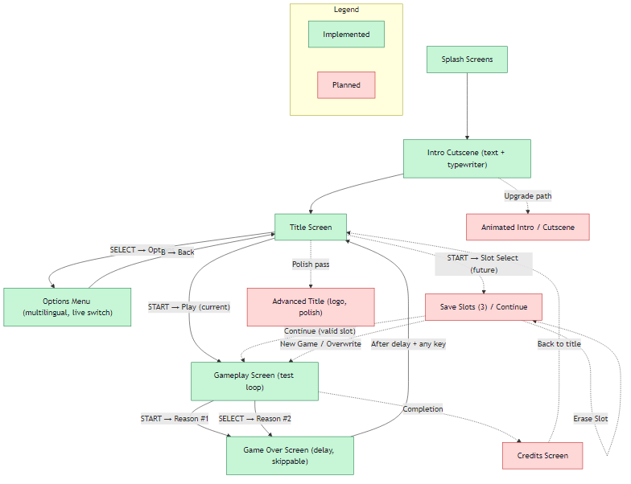

# GBC C Starter Kit


<!-- Linguaggio -->


A starter kit for developing **Game Boy Color** games in **C**, powered by **gbdk-2020**, **CMake**, and **Ninja**.
Provides a clean project structure and build setup to jumpstart your homebrew development.

## Description

This repository is a **template project** for Game Boy Color homebrew development.
It includes a ready-to-use setup with **gbdk-2020**, **CMake**, and **Ninja**, providing developers with:

- A clean folder structure for source code and assets
- A complete build configuration for cross-platform compilation
- A minimal working example to start coding right away

## Requirements

This project is primarily set up for **Windows** with **Visual Studio Code**,
but it can be adapted to other platforms with minor changes.

Make sure the following tools are installed:

- [**gbdk-2020**](https://github.com/gbdk-2020/gbdk-2020) – C compiler and libraries for Game Boy / Game Boy Color development
- [**CMake**](https://cmake.org/download/) (version 3.16 or higher) – project configuration and build system generator
- [**Ninja**](https://ninja-build.org/) – fast, portable build system
- A standard C compiler (e.g., GCC or Clang)
- [**Visual Studio Code**](https://code.visualstudio.com/) with CMake Tools extension (recommended)
- [**bgbw64**](https://bgb.bircd.org/) – Game Boy / Game Boy Color emulator used to run the compiled ROMs

## Features

- Preconfigured project structure for **Game Boy Color** homebrew in C
- Ready-to-use **CMake** setup for modern project management
- Support for **Ninja** as a fast and portable build system
- Compatible with **Visual Studio Code** on Windows (with CMake Tools extension)
- Integrated with **bgbw64 emulator** for testing the compiled ROMs directly from the project
- Minimal working game example included (splash → intro → title → gameplay → credits)
- Clean folder layout for source code, headers, and assets
- Easy to extend for larger projects

## Getting Started

Follow these steps to build and run your first Game Boy Color ROM:

1. **Clone the repository**

```bash
git clone https://github.com/spinellifabio/gbc-c-starter-kit.git
cd gbc-c-starter-kit
```

2. **Generate the build files with CMake**

```bash
cmake -B build -G Ninja
```

3. **Compile the project**

```bash
ninja -C build
```

After compilation, the `.gbc` ROM file will be generated inside the `rom/` directory.

4. **Run the ROM with bgbw64**

```bash
start bgbw64.exe rom/your-game.gbc
```

By default the prototype runs through splash, intro cutscene, title, gameplay test loop, then shows the credits scene (skippable with START/SELECT) before returning to the title screen.

### Visual Studio Code (recommended)

If you are using **Visual Studio Code** with the *CMake Tools* extension:

- Open the folder `gbc-c-starter-kit/` in VS Code
- Select the CMake preset for **Ninja**
- Build the project using the CMake Tools commands
- The compiled ROM will automatically launch in **bgbw64** if configured in `CMakeLists.txt`

## Configuration / Custom Paths

Some paths in this template are **preconfigured for Windows** and may need to be updated according to your system setup.

### 1. gbdk-2020 include path

In `.vscode/settings.json`, update the `C_Cpp.default.includePath` entry to match where you installed **gbdk-2020**:

```json
"C_Cpp.default.includePath": [
    "C:/path/to/your/gbdk/include",
    "${workspaceFolder}/src"
]
```

### 2. BGB Emulator path

Both `.vscode/tasks.json` and `.vscode/launch.json` reference the path to **bgbw64**. Update these to point to your emulator location:

**tasks.json**

```json
"command": "\"C:/path/to/bgbw64/bgb64.exe\" \"${workspaceFolder}/rom/${workspaceFolderBasename}.gb\""
```

**launch.json**

```json
"program": "C:/path/to/bgbw64/bgb64.exe",
"args": [
    "${workspaceFolder}/rom/${workspaceFolderBasename}.gb"
]
```

### 3. CMake run target

In `CMakeLists.txt`, the path to the emulator is set in the `BGB_EXE` variable:

```cmake
set(BGB_EXE "C:/path/to/bgbw64/bgb64.exe")
```

Adjust this path to match your system, so the `run` target can launch the ROM automatically after building.

> **Tip:** If you move your emulator or gbdk installation in the future, make sure to update all relevant paths in these files to avoid build or launch errors. ⚠️

## Project Structure

The repository is organized as follows:

```text
gbc-c-starter-kit/
│── .vscode/                    # VS Code configuration (tasks, launch settings)
│   │── extensions.json         # VS Code extensions
│   │── launch.json             # Launch configuration
│   │── settings.json           # User settings
│   └── tasks.json              # CMake tasks
│── assets/                     # Graphics, tiles, maps
│   └── sprites                 # Sprite graphics
│── build/                      # Output directory (generated after compilation)
│── cmake/                      # CMake scripts
│   └── gbdk-toolchain.cmake    # Toolchain configuration
│── docs/                       # Project documentation
│── include/                    # Header files
│   └── sprites.h               # Sprite graphics
│── res/                        # Resource files
│   └── sprites/                # Sprite graphics
│── rom/                        # Compiled ROMs
│── src/                        # C source code
│   └── main.c                  # Minimal working example
│── .gitignore                  # Ignored files
│── CMakeLists.txt              # Main build configuration
│── CMakePresets.json           # CMake presets
└── README.md                   # Project documentation
```

This structure keeps source code, headers, and assets separated for clarity.
The `build/`, `CMakeFiles/`, and `rom/` directories are ignored by version control and only contain generated files.

### Screens Flow

The following diagram shows the screen flow for the GBC prototype. Nodes styled in green are **implemented**; nodes in red are **planned** in the roadmap.



## Goal

The goal of this starter kit is to provide a **solid foundation for Game Boy Color homebrew development**.

It is designed for developers who want to:

- Quickly start coding in **C** for the Game Boy Color
- Use a modern and maintainable build system with **CMake** and **Ninja**
- Test ROMs immediately using the integrated **bgbw64 emulator**
- Have a clean and organized project structure that can scale for larger projects

This template is meant to reduce setup time, allowing developers to focus on **creating games** rather than configuring the build environment.

See the **[Roadmap](docs/roadmap.md)** for planned features and updates.

## Keywords

gameboy-color, gbc, gbdk-2020, cmake, ninja, c-programming, starter-kit, template, homebrew, romhacking, bgbw64

## Resources / Documentation

- [Game Boy History](https://laroldsretrogameyard.com/articles/long-live-the-nintendo-game-boy/) – A detailed history of the Game Boy
- [GBDK-2020 Official Documentation](https://gbdk-2020.github.io/gbdk-2020/) – Reference for Game Boy / Game Boy Color development in C
- [Game Boy Development Wiki](https://gbdev.io/) – Guides and technical details about the hardware
- [Ninja Build System](https://ninja-build.org/) – Documentation for the build tool
- [CMake Documentation](https://cmake.org/cmake/help/latest/) – Full reference for CMake commands and usage
- [bgbw64 Emulator](https://bgb.bircd.org/) – Official emulator for testing Game Boy / Game Boy Color ROMs
- [Free Game Boy / Game Boy Color Assets](https://itch.io/game-assets/free/tag-gameboy/tag-pixel-art/tag-retro) – Free game assets for Game Boy / Game Boy Color homebrew development
- [PNG to GB Asset Converter](https://laroldsretrogameyard.com/tutorials/gb/png2asset-graphics-creation-for-gbdk-2020/) – Tool for converting PNG files to Game Boy graphics
- [RPG-Style Movement](https://laroldsretrogameyard.com/tutorials/gb/rpg-style-movement-in-gbdk/) – Tutorial for RPG-style movement in Game Boy development
- [Game Boy Graphics](https://irfanbstr.medium.com/gbdk-2020-understanding-the-gameboys-graphics-847ef2d2db08) - Understanding the Game Boy's Graphics in Game Boy development
- [Learn about retro game development!](<https://laroldsretrogameyard.com/category/tutorials/gb/>) – A collection of tutorials for Game Boy development
- [Drawing Advanced Dialogue Boxes](https://laroldsretrogameyard.com/tutorials/gb/drawing-advanced-dialogue-boxes/) - Tutorial for drawing advanced dialogue boxes in Game Boy development

## Credits

```text
 $$$$$$\  $$$$$$$\   $$$$$$\         $$$$$$\         $$$$$$\    $$\                          $$\                               $$\   $$\ $$\   $$\
$$  __$$\ $$  __$$\ $$  __$$\       $$  __$$\       $$  __$$\   $$ |                         $$ |                              $$ | $$  |\__|  $$ |
$$ /  \__|$$ |  $$ |$$ /  \__|      $$ /  \__|      $$ /  \__|$$$$$$\    $$$$$$\   $$$$$$\ $$$$$$\    $$$$$$\   $$$$$$\        $$ |$$  / $$\ $$$$$$\
$$ |$$$$\ $$$$$$$\ |$$ |            $$ |            \$$$$$$\  \_$$  _|   \____$$\ $$  __$$\\_$$  _|  $$  __$$\ $$  __$$\       $$$$$  /  $$ |\_$$  _|
$$ |\_$$ |$$  __$$\ $$ |            $$ |             \____$$\   $$ |     $$$$$$$ |$$ |  \__| $$ |    $$$$$$$$ |$$ |  \__|      $$  $$<   $$ |  $$ |
$$ |  $$ |$$ |  $$ |$$ |  $$\       $$ |  $$\       $$\   $$ |  $$ |$$\ $$  __$$ |$$ |       $$ |$$\ $$   ____|$$ |            $$ |\$$\  $$ |  $$ |$$\
\$$$$$$  |$$$$$$$  |\$$$$$$  |      \$$$$$$  |      \$$$$$$  |  \$$$$  |\$$$$$$$ |$$ |       \$$$$  |\$$$$$$$\ $$ |            $$ | \$$\ $$ |  \$$$$  |
 \______/ \_______/  \______/        \______/        \______/    \____/  \_______|\__|        \____/  \_______|\__|            \__|  \__|\__|   \____/

                                                                                                       v1.0.0 - Code assembled in spare time by Fabio
```
